# PhotoSite Application & Deployment on AWS using docker

- [Introduction and Purpose](https://github.com/rishabparekh14/R-AWS/wiki#section-1-introduction-and-purpose)
- [AWS S3 Bucket](https://github.com/rishabparekh14/R-AWS/wiki#aws-s3-bucke)
- [Creating Ruby on Rails PhotoSite Application](https://github.com/rishabparekh14/R-AWS/wiki#steps-followed-to-create-ruby-on-rails-application)
- [Running PhotoSite using Ruby Mine IDE](https://github.com/rishabparekh14/R-AWS/wiki#steps-followed-to-create-ruby-on-rails-application)
- [Docker Container](https://github.com/rishabparekh14/R-AWS/wiki#docker-container)
- [Docker Image](https://github.com/rishabparekh14/R-AWS/wiki#docker-image)
- [Create Docker Image and Running locally using Docker Image](https://github.com/rishabparekh14/R-AWS/wiki#create-docker-image)
- [AWS EC2 Instance creation](https://github.com/rishabparekh14/R-AWS/wiki#aws-ec2-instance-creation)
- [AWS EC2 Deployment of PhotoSite app using Docker Image](https://github.com/rishabparekh14/R-AWS/wiki#aws-ec2-deployment-of-photosite-app-using-docker-image)
- [PhotoSite running on AWS EC2 Instance](https://github.com/rishabparekh14/R-AWS/wiki#aws-ec2-instance-running-photosite-access)
- [PhotoSite Application Status](https://github.com/rishabparekh14/R-AWS/wiki#section-3-this-application-is-working-properly-end-to-end-no-open-issue-is-present)
- [YouTube URL for Project Demo](https://github.com/rishabparekh14/R-AWS/wiki#section-4--youtube-url)
- [Special Issue 1’s Solution - AWS EC2 instance's image creation](https://github.com/rishabparekh14/R-AWS/wiki#aws-ec2-instances-image-creation)
- [Special Issue 2’s Solution - AWS EC2 instance's Elastic IPs](https://github.com/rishabparekh14/R-AWS/wiki#aws-ec2-instances-elastic-ips)
- [PhotoSite Image Used Reference](https://github.com/rishabparekh14/R-AWS/wiki#photosite-images-taken-from---httpborgcsueastbayedugrewecs651projectr_aws_part1tipshtml)

## Section 1 Introduction and Purpose

### Introduction 
* This is  a simple Photo sharing application made on Ruby on Rails. User can view photos, comments, etc. by clicking on the name link.
This application has comment section which has pre entered data using SQLite database. The images used for this application is stored in S3 bucket. Docker image of this project created and stored on Docker Hub. This application is deployed and run on AWS EC2 instance using docker image from Docker Hub.
EC2 instance support Elastic IP address so, that EC2 instance Start and Stop Instance doesn't change public IP addess for access of PhotoSharing application.
This EC2 instance has image copy saved so, that when EC2 instance is under heavy load or has failure copy is this EC2 instance can be luanched for load balancing without need to PhotoSite Software deployment again and quickly.

YouTube URL - https://youtu.be/rTRQ0v6z0wU

GitHub Code Link - https://github.com/rishabparekh14/R-AWS

GitHub Wiki Link - https://github.com/rishabparekh14/R-AWS/wiki

### Purpose

* The purpose of this application is to learn basics using hands on exercise of Ruby on Rails application developement, database creation using Rails, AWS S3 storage bucket creation & using that, Docker Hub familiarization, docker image generation, pushing/pulling docker image to/from Docker Hub, AWS EC2 instance creation, deploying application to AWS EC2 (IaaS) and access AWS EC2 instance based running application from public IP. 

## AWS S3 Bucket

### Creating and Uploading Images in AWS S3 Bucket

1. In AWS management Console click on S3.
2. Click on Create bucket.

3. Click Upload. Upload file/files you want to add to S3 Bucket.

4. Go to Permission. If you want to give public access to files click Block-Public Access. Deselect Block all Public Access.
5. Go to Bucket Policy. Click Policy genrator.
6. A new window will appear. 

	 * Select Policy type: S3 bucket Policy.
	 * Effect: Allow
	 * Actions: GetObject
	 * Paste bucket ARN followed by /* .
	 * Click Add Statement.
	 
	 * Click Genrate Policy. 
	 * Copy Json.
	 * Go to Bucket Policy and paste Json in the policy section. 
	 * Click save.

 
7. Go to Objects tab. Click on the file.

8. In Properties section you can see the Object URL.

### Steps Followed to Create Ruby on Rails Application.
 *  Create a new Rails application project .
 
        New Project -> Rails -> application -> add Ruby SDK and Rails version. For database select sqlite3. Click Create.
 * Create three models for user, photo and comment.

 
 		Go to Tools -> Run Rails Generator -> Name the model.
 	
 * Go to
 
 		db->migrate 
 You will see files generated corresponding to the user, photo and comment. Add the columns you want to add in the database and specify their data type. 
 
 *  Create a new data migration file load_data which will have pre configured data. ( This data file is taken from Professor's website )
 To add this file go to 
 
 		Tools-> Run Rails Generator -> migration and name it load_data. 
 Now you can see there are four migration files in db -> migrate.
 * Now Run the migration file by the following command RubyMine IDE: 

 		Tools->Run Rake Task -> db:migrate
  * Now to view tables :
     1. Go to Databses in the right.
     2. Click on + symbol.
     
     3. Go to import data sources.
     
     4. Click SQLite
     5. Click Create.
     6. To view go to
     
     			databases -> Rails PhotoSite development -> schemas -> main -> click users
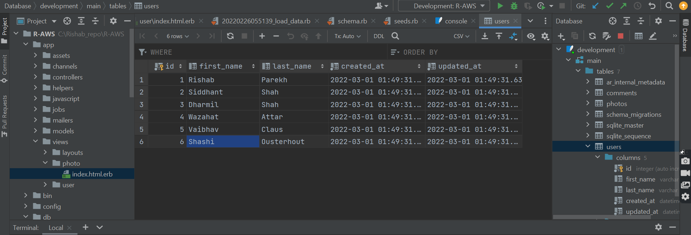
* Create two controllers for user, and photo.
* Go to views and crete index.html.erb file for photo and user.
* Go to folder 

		views -> photo -> index.html.erb. Add the path of S3 bucket URL which contains image. 
.

### Run PhotoSite application locally using Ruby Mine IDE
1. Run this Git project using Ruby Mine IDE. This will start server in listening mode.

2. Open "http://localhost:3000/user/index" PhotoSite URL in browser. This shows PhotoSite app's HOME page.
Click on index #4 and it will open new page. This will shows images, comments posted with date & time.
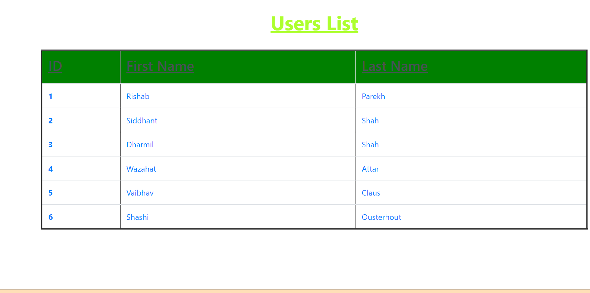
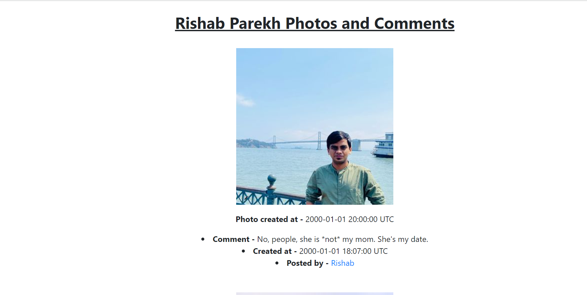
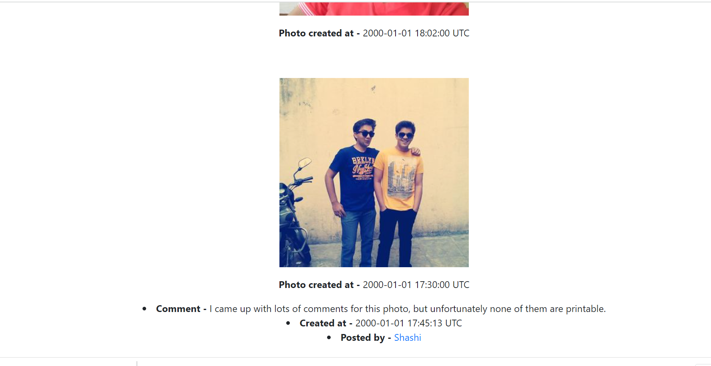

  
     
 

#### Docker Container

* First, we create application on local device such as laptops/computers. Then, docker is used to create image of local Ruby on Rails application. Then, this image is used by AWS EC2 instance. 

 Docker is used to create image because it reduces the burden of installing each and every dependencies of application seperately. The image created by docker can directly be deployed by AWS EC2 instance.
 
 To create a docker image of our application we need to add the docker file and docker-compose.yml file in our local Ruby on Rails Application. Then, we need to create a repository in Docker Hub. After creating the repository, we will create a  docker image of our application. This image is used by EC2 instance.
 
 Further details about docker is given below.

## SECTION 2) Demonstration of Application working successfully deployed via Docker & runs

### Docker Image

#### Create a repository in Docker Hub

1. Click on create the repository and Enter the repository name, it's description. 
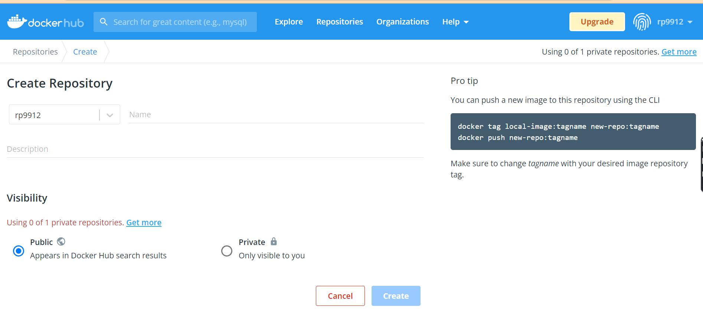

2. After creating the repository, it will show docker push command for this repository. 
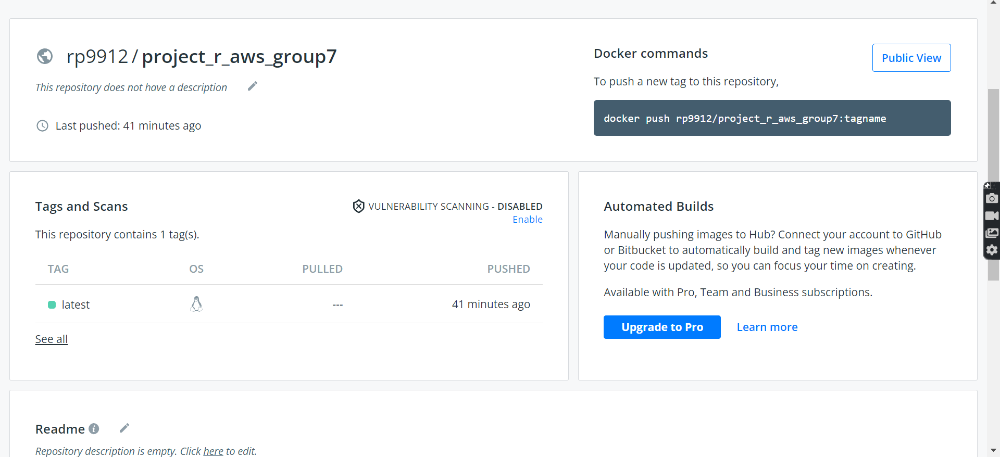

#### Create docker image 

1. Add docker file in Ruby Mine IDE project of PhotoSite.
This file contains ruby version used and different SW like yarn, nodejs, bundle, gem etc installation instruction needed to create docker image.
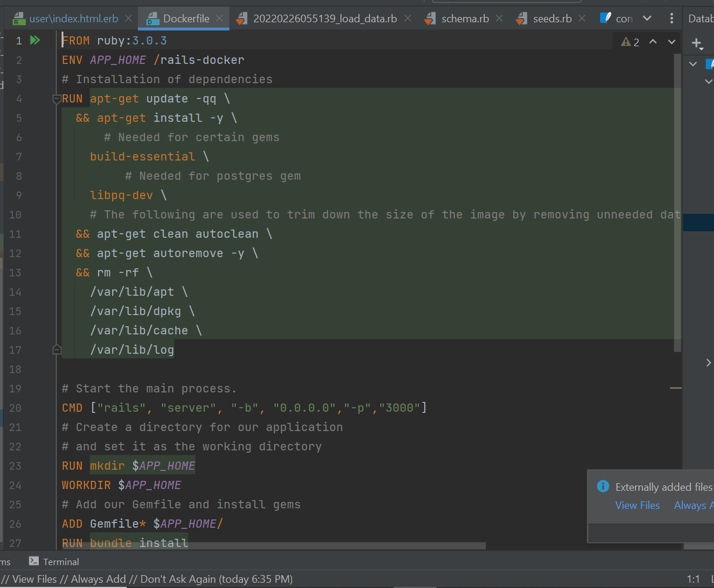

2. Add docker-compose.yml file in the project.
This file contanis version and rails server port information.
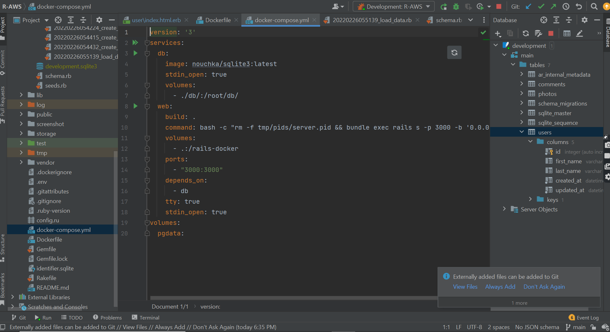

3. Go to PhotoSite folder using Terminal where docker file is present and Run command

		docker build -t photosite:docker . 
to build and generate docker image with name "photosite" and TAG "docker"
 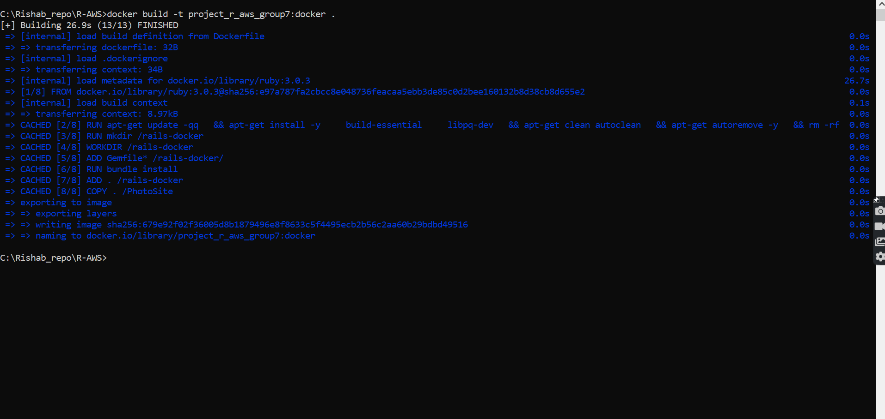

4. Run docker image based PhotoSite app on local laptop
using command 

		docker run -it -p 3000:3000 photosite:docker 
This will start server in listening mode.
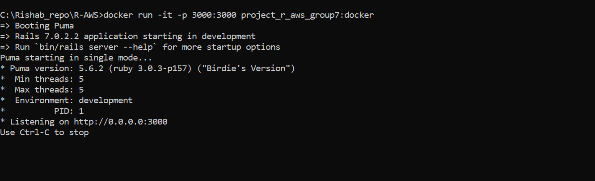

5. While running docker if you face error "Your Yarn packages are out of date!"
 Run 

		rm -rf node_modules/
  Then Go to step #3 and start again
		

6. Open "http://localhost:3000/user/index" PhotoSite URL in browser. This shows PhotoSite app's HOME page.
Click on index #4 and it will open new page. This will shows images, comments posted with date & time.

7. Check docker images created after build using command 

		docker images
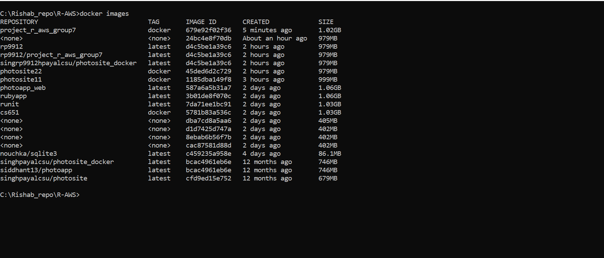

8. Tag the docker image for upload using command 

		 docker tag project_r_aws_group7:docker rp9912 
and check the image name after tagging using command 

		docker images

9. Upload docker image to docker hub using command 

		docker push rp9912/webproject

10. Login to Docker Hub website and check "photosite_docker" image is availabel 
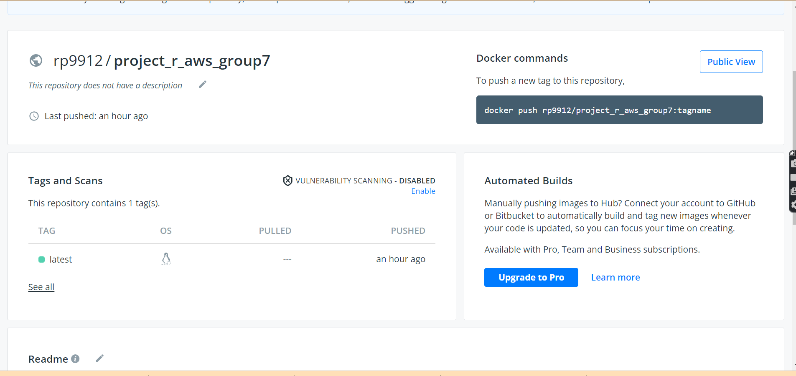

11. Click on "public view" and it shows docker image pull link

		docker pull rp9912/webproject
	 		
Use this command to download docker image
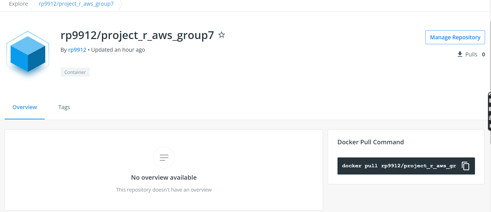

### AWS EC2 

#### AWS EC2 instance creation
1. Open and Login the AWS EC2 url 

		https://console.aws.amazon.com/ec2/

2. Click 

		Launch Instance

3. Select 

		Free tier only 
on Left Panel and then select 

		Ubuntu Server 20.04 LTS (HVM)
You can also select at this point "Amazon Linux 2 AMI (HVM)". After this select "64-bit (x86)" and click 

		Select

4. "Choose an Instance Type" as 

		"t2.micro" and click "Configure Instance Details"

5. Let "Configure Instance Details" be default and click 

		"Next:Add Storage"

6. Let "Add Storage" be default with 8 GB and click 

		"Next: Add Tags"

7. Let "Add Tags" be default and click 

		"Next: Configure Security Group"

8. In "Configure Security Group" page create new security group using 

		"Assign a security group" and name "Security group name:"
		Add "SSH" Type with source "Anywhere" and then click "Add Rule"
		Add "Custom TCP Rule" with source "Anywhere" and Port Range 0.
This is needed to access the PhotoSite link from anywhere once it is deployed on EC2 instance.
Then click 
		
		"Review and Launch".

9. "Review Instance Launch" the configuration details and click 

		"Launch".
		"Create a new pair key" and add "Key pair name" as 		"photosite_docker" and Download KEY Pair file 		"photosite_docker.pem". This is "private key file" to connect to EC2 instance securely.

10. After this click 

		"Launch Instances" 
and this launches new EC2 instance with this configuration

11. Wait for few minutes to allow EC2 instance to move to

		"Instance state" "Running" and "Status Check" "2/2 checks passed"

12. After this select the instance and click 

		"Connect" and this open "Connect to instance" page with detailed to login EC2 instance and click "SSH Client" Tab for details to access this EC2 instance through Terminal or Putty.

#### AWS EC2 Deployment of PhotoSite app using Docker Image 

##### AWS EC2 instance deployment setup for running on "Ubuntu Server 20.04 LTS (HVM)" - 
1. Open Terminal and go to the folder where 

		"private key file" "photosite_docker.pem" is downloaded or stored. 
Then Run below command to login to EC2 instance (this command info is from above #12 "SSH Client" Tab)

		chmod 400 photosite_docker.pem
		
		ssh -i "photosite_docker.pem" ubuntu@ec2-3-224-158-141.compute-1.amazonaws.com

2. This provides EC2 instance terminal for deployment of PhotoSite app using Docker Image.

3. Run command below command to install docker utility on EC2 instance.

		sudo apt-get update

4. Run

		sudo apt-get install     apt-transport-https     ca-certificates     curl     gnupg-agent     software-properties-common

5. Run 

		curl -fsSL https://download.docker.com/linux/ubuntu/gpg | sudo apt-key add -

6. Run 

		sudo apt-key fingerprint 0EBFCD88

7. Run

		sudo add-apt-repository    "deb [arch=amd64] https://download.docker.com/linux/ubuntu $(lsb_release -cs) stable" 
   
8. Run

		sudo apt-get update

9. Run

		sudo apt-get install docker-ce docker-ce-cli containerd.io
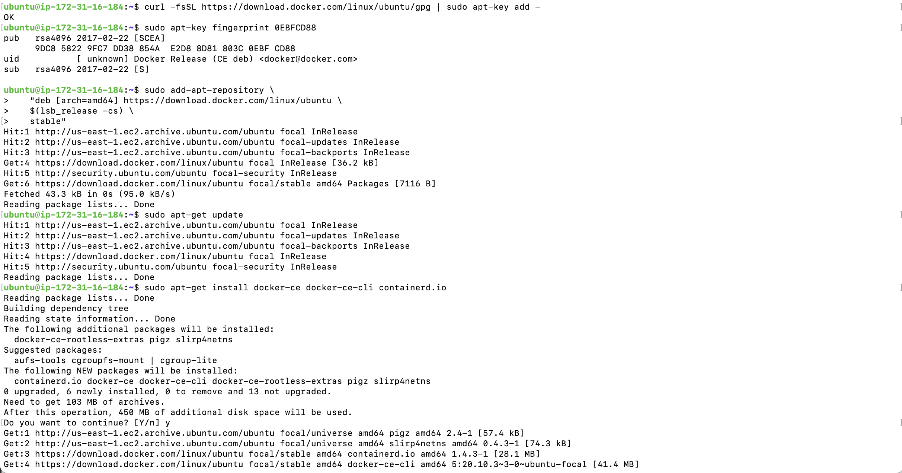

10. Run

		apt-cache madison docker-ce

11. Run

		sudo apt-get install docker-ce=5:20.10.3~3-0~ubuntu-focal docker-ce-cli=5:20.10.3~3-0~ubuntu-focal containerd.io

##### AWS EC2 instance deployment setup for running on "Amazon Linux 2 AMI (HVM)" -

1. Open Terminal and go to the folder where "private key file" "photosite_docker.pem" is downloaded or stored. Then Run below command to login to EC2 instance (this command info is from above #12 "SSH Client" Tab)

		chmod 400 photosite_docker.pem
		
		ssh -i "photosite_docker.pem" ubuntu@ec2-52-23-171-145.compute-1.amazonaws.com

2. This provides EC2 instance terminal for deployment of PhotoSite app using Docker Image.

3. Run command below command to install docker utility on EC2 instance.

4. Run

		sudo yum update -y

5. Run

		sudo yum install docker -y

##### AWS EC2 deploymnet of PhotoSite on both "Ubuntu Server 20.04 LTS (HVM)" and "Amazon Linux 2 AMI (HVM)" -

1. Once above setup for deployment done for "Ubuntu Server 20.04 LTS (HVM)" and "Amazon Linux 2 AMI (HVM)", Run below command

2. To start docker service on EC2 instance 

		sudo service docker start

3. To install and run docker image of PhotoSite 

		sudo docker run -it -p 3000:3000 rp9912/webproject 
This will install PhotoSite from Docker Hub if not install and then run the PhotoSite.
This will start PhotoSite server in listening mode.

##### AWS EC2 instance running PhotoSite Access
1. Open "http://http://52.3.61.74:3000/user/index" PhotoSite URL in browser. This shows PhotoSite app's HOME page.
Click on index #4 and it will open new page. This will shows images, comments posted with date & time.

## SECTION 3) This application is working properly end to end. No open issue is present.

## SECTION 4)  YouTube URL
https://www.youtube.com/watch?v=I8G6MynMPTU

## SECTION 5) Special Issue 1

###  What happens when an instance stops running?

When the instance stops running we may loose our data.

###  Solution:

#### AWS EC2 instance's image creation
AWS EC2 instance's image help to create and deploy copy of existing EC2 instance
for load balancing when one instance has fault or under heavy load of traffic.
New EC2 instance creation from AWS EC2 instance's image follow normal flow of Instance creation after Step #4 mentioned below and it already has SW deployed for instance from which image is created & ready to run.

1. Go to EC2 instance, select the EC2 instance.

2. Right click on the Instance and then go to "Image and Templates" and select "Create image".

3. Enter "Image Name" and "Image description" and click create to create image

4. Select "AMIs" in Left Side selection link to view and launch instance of newely created image. To launch EC2 instance creation from images - select image box and click Launch and follow normal EC2 instance creation flow.

### SECTION 6) Special Issue 2

#### What happens when reboot instance & what can you do?

When we reboot the instance the IP address changes.

#### Solution:

#### AWS EC2 instance's Elastic IPs

An Elastic IP address is a public IPv4 address. With the help of Elastic IP address we can mask this failure of our instance. This can be done by remapping the address to another instance in our account. Suppose, if our instance does not have a public IP address then, we can associate Elastic IP address  with our instance in order to make it communicate with internet.

AWS impose small hourly charge if an Elastic IP address is not  associated with a running state. It also impose small hourly charge for an instance which is associated with a stopped instance. When we are running our instance we are not charged for one Elastic IP address which is associated with the instance. However, they will charge for any additional Elastic IP address associated with the instance.  

An Elastic IP address is a static IPv4 address designed for dynamic cloud computing. An Elastic IP address is allocated to EC2 instance until it is released. So, anytime EC2 instance is stop and start (until terminated), it can use same IP address for public access.

1. Select the EC2 instance and in Left side selection panel select "Elastic IPs"

2. Select "Allocate Elastic IP address"

3. Select "Amazon's Pool of IPv4 address" 

4. Select "Action" drop down and click "Associate Elastic IP address"

5. Select one of availabel "Private IP address" and check "Allow this Elastic address to be reassociated" and then click "Associate"

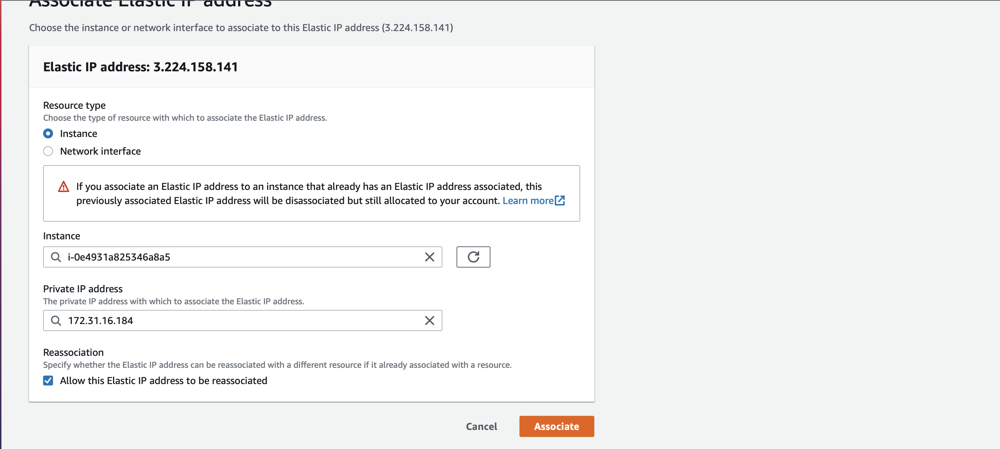

6. Check the EC2 instance's "Details" section for "Elastic IP addresses".
Also on Left side selection panel select "Elastic IPs" to see details of Elastic IP address
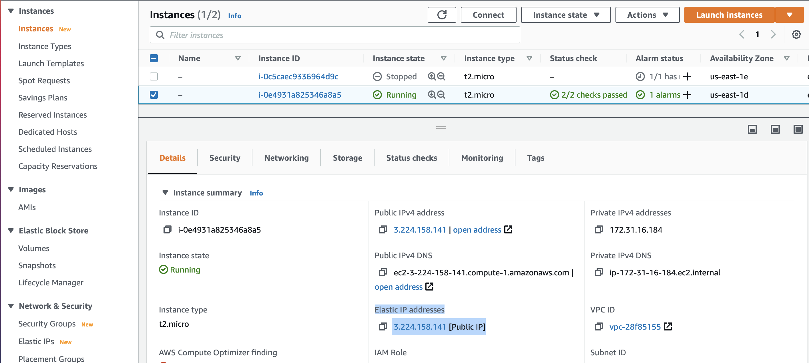

###### PhotoSite Images taken from - http://borg.csueastbay.edu/~grewe/CS651/ProjectR_AWS_PART1TIPS.html

 

